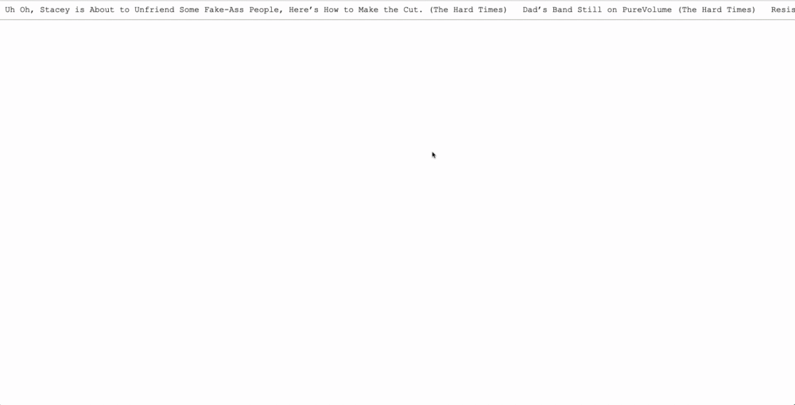

# Twitter Ticker

"Twitter Ticker" is a not very serious minimalist ticker displaying the newest tweets of three satrical websites, namley The Onion, The Hard Times and Clickhole. It's using the Twitter API and was a small project done during my time at [SPICED Academy](https://www.spiced.academy/program/full-stack-web-development/).

---

## Siteflow

## Tech

HTML, CSS, JavaScript ES6 / Promises, jQuery, Node / Express, Twitter API, AJAX, Base64 Encoding

## Features

-   The latest headlines / tweets of three accounts are shown as clickable hyperlinks that scroll for right to left. On hovering the "scrolling"-animation stops and resumes after hovering is stopped.

-   The server makes three simultaneous requests to get tweets and sends back a merged list of tweets in response to the single ajax request it received. The combined list of tweets that are sent to the client are sorted in reverse chronological order.

-   Tweets that do not include other media (e.g. videos) are excluded

-   base64 encoding a string for Authorization header.

## Goals while doing the project

-   Learn using a API in Node

-   Learn using ES6 Promises

-   Use `requestAnimationFrame()` and `cancelAnimationFrame`
